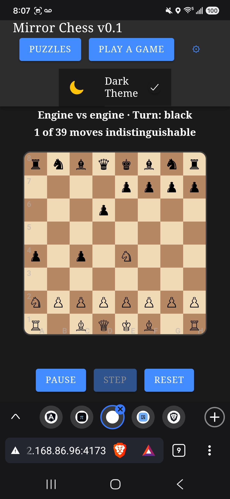
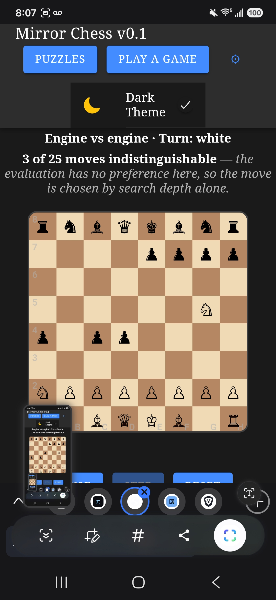

# Bug — the board jumps between moves, because the text above it changes height

> **Status: BACKLOG — reported by the owner from a phone, 2026-10-10, with screenshots.**
> Part of the [quality epic](./README.md). Caused by
> [`../balance/watch-a-game.md`](../balance/watch-a-game.md), shipped the day before.
> Fix alongside [`responsive-design-pass.md`](./responsive-design-pass.md), which covers
> the same surfaces.

## 1. What happens

On the watch screen the gauge above the board is **one line** for some positions and
**three** for others, so the board and every control below it jump up and down **between
moves** — several times a second while a game runs. At three lines the Play / Step / Reset
buttons are pushed off the bottom of a phone screen entirely.

| One line (`1 of 39`) | Three lines (`3 of 25`) |
| --- | --- |
|  |  |

## 2. Root cause

`SelfPlayScreen.tsx` renders an explanatory sentence **conditionally**:

```tsx
<strong>{gauge}</strong>
{diagnostics.indistinguishable > 1 && (
  <span className="selfPlayHint"> — the evaluation has no preference here, …</span>
)}
```

`indistinguishable` is `1` whenever the evaluation finds a single best move and `> 1`
otherwise — which flips constantly during a game. So a block **above** the board changes
between one and three rendered lines on most moves, and everything below it moves.

The gauge text itself also varies in width (`3 of 25` vs `1 of 39`), which is harmless on
its own; it is the wrapped line count that moves the board.

> **The general shape, worth more than the fix:** *anything above the primary content whose
> presence or height is conditional will move the primary content.* The board is the thing
> a player is aiming a thumb at.

## 3. Why no test caught it — and why the screenshot did not either

`check:a11y` measures the board's box at four widths and passed, because it measures **one
state**. The e2e suite asserts on text and testids, never on position.

The sharper point: **this screen was screenshotted before it shipped, and the screenshot
was looked at.** It showed the three-line state, and it looked fine — because a layout
shift is not a property of a layout, it is a property of a **transition**.

> **A screenshot proves a layout. Two screenshots prove a transition.** For anything that
> re-renders on a timer or on live data, capture it in at least two states and compare the
> geometry, not the pixels.

## 4. What to do

The owner's instruction, 2026-10-10:

> "We want to be intelligent, pre-allocate an area, and if that text overflows we can allow
> a tap to view all of it on mobile. Same with the step count."

So:

- [ ] **Reserve the space.** Give the gauge region a fixed height (or `min-height` in `ch`
      / `lh` units) sized for its longest reasonable content, so the board never moves.
      Prefer reserving over shortening: the sentence is the thing that makes the gauge
      legible to someone who has not read the story.
- [ ] **Clamp and expand.** When the text exceeds the reserved area, clamp it
      (`-webkit-line-clamp`) and make the region tappable to reveal the rest — a disclosure,
      not a tooltip, so it works by touch and by keyboard and is announced.
- [ ] **Same treatment for the move log** ("the step count"): a fixed region, scrolling or
      expandable, that does not resize the page as rows arrive.
- [ ] **Audit every other conditional block above the board** for the same fault — the
      game screen's `.moveMessage` already reserves `min-height: 1.25rem` for exactly this
      reason, which is the pattern to copy, and the submit bar added on 2026-10-09 does
      **not** reserve anything.
- [ ] **A regression test that can fail.** Measure the board's bounding box across several
      consecutive moves and assert it does not move. A single-state assertion cannot catch
      this class of bug, and `check:a11y` is the natural home.

## 5. Notes

- Both screenshots are in dark theme on a real phone, which is also where the header takes
  two rows and eats vertical space — see
  [`responsive-design-pass.md`](./responsive-design-pass.md) §1.
- The same conditional-text pattern exists in `PuzzleScreen` (the verdict line changes
  between one and two lines) and should be checked while the fix is fresh.
