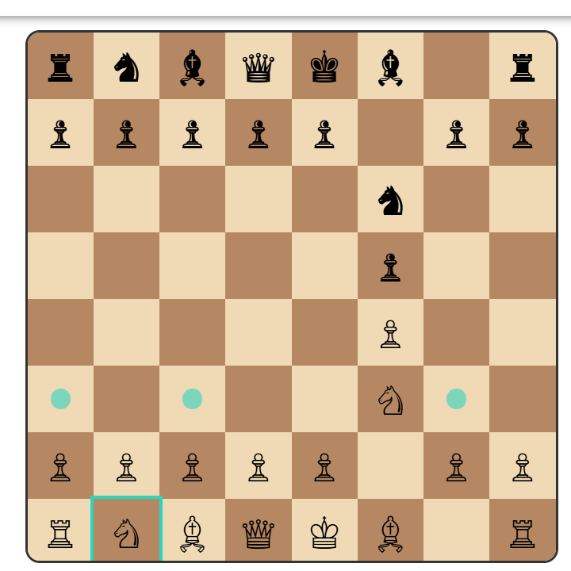

# Move Empty Space Feature

## Regular Chess Move

As a user, I want to be able to move an empty space on the board so that I can rearrange pieces.

### Acceptance Criteria
- After selecting a piece, I can click an empty space on the board, when I select it , then the empty space should move in that direction if the move is valid.

## Mirror Chess Move

The left and right walls are portals. Pieces that move left or right and hit the wall should appear on the opposite wall and continue moving in the same direction, using usual chess movement rules.

## RESOLVED: Bug

The queen on c6 should be able to move to h6, due to how the mirror left/right movement works. The queen should be able to move to the left until it hits the portal on the left wall and then appear on the right wall and continue moving left until it hits h6.

## Bug

When selecting the knight on b1 I shouldn't be able to move to G3.

